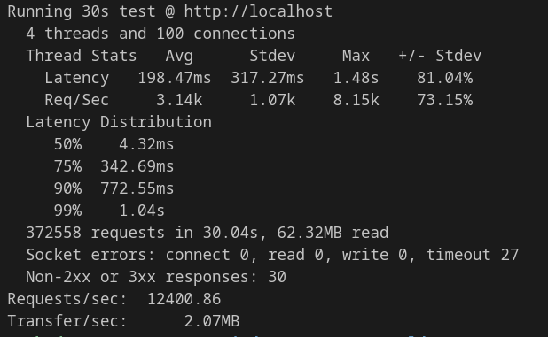
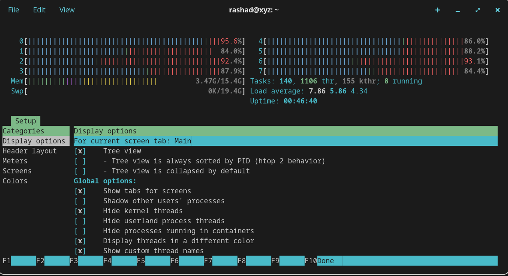

# High-Frequency Limit Order Book (LOB) Engine

A deterministic, ultra-low latency matching engine written in modern C++20. This Minimum Viable Product (MVP) simulates the core infrastructure of a high-frequency trading (HFT) exchange, processing thousands of orders per second with strict price-time priority.


### Live Deployment
* **REST API (Ingestion):** `http://130.61.142.132`
* **WebSocket (Trade Feed):** `ws://130.61.142.132:8080`

---

## Core Architecture & Engineering

This engine was built from the ground up to avoid kernel locks, minimize L1/L2 cache pollution, and physically protect its memory from network floods.

* **Lock-Free Ingestion (Control Plane):** An Nginx reverse proxy routes HTTP traffic to a 32-thread `cpp-httplib` gateway. Orders are instantly pushed into a power-of-two (65,536) atomic Ring Buffer, allowing network threads to yield immediately without blocking the core engine.
* **Deterministic Matching:** A single, dedicated CPU thread pops orders from the ring buffer and matches them using $O(\log N)$ Red-Black trees (`std::map`).
* **O(1) Cancellation Tracking:** Active orders are tracked in an auxiliary `std::unordered_map`. Cancellation requests bypass the price queues, targeting and eradicating nodes in $O(1)$ lookup time.
* **Targeted Cancellation Tracking:** Active orders are mapped in an auxiliary `std::unordered_map` for $O(1)$ price-level lookups. This completely bypasses linear book scanning, allowing the background thread to jump directly to the target Red-Black tree node and eradicate the order in $O(\log N)$ time.
* **Fast Order Cancellation:** Active orders are tracked in a separate hash map. When a trader cancels an order, the engine uses this hash map to instantly look up the exact price level. It then jumps straight to that specific price in the tree and removes the order.
* **Hardware Preservation (Load Shedding):** If the arrival rate ($\lambda$) exceeds the processing rate ($\mu$) and the ring buffer fills, the gateway instantly rejects traffic with `429 Too Many Requests` rather than holding TCP connections hostage.
* **Asynchronous Data Plane:** Executed trades are pushed to an outbound ring buffer. A dedicated `asio`/`websocketpp` thread handles JSON serialization and broadcasts the market feed, completely bypassing the Nginx proxy to reduce latency.


## Performance Benchmarks

Tested via `wrk` with 100 concurrent connections over 30 seconds on an 8-core machine. The goal of this benchmark was to push the arrival rate past the processing rate to verify the integrity of the engine's backpressure mechanisms.




*Figure 1: Benchmark results demonstrating ~12,400 Requests Per Second (RPS). The median latency sits at a highly stable 4.32ms. As the synthetic flood intentionally overfills the lock-free ring buffer, the tail latency rises (queueing theory in effect), and the gateway successfully sheds unmanageable load (30 Non-2xx responses) to preserve hardware memory and prevent cascading failure.*

### Hardware Saturation & Telemetry
The architecture is mathematically proven to be lock-free by observing the kernel-level thread distribution under this maximum synthetic load.




*Figure 2: `htop` telemetry captured during the 12,000+ RPS flood. The Nginx reverse proxy and the 32-thread `cpp-httplib` gateway uniformly saturate all 8 logical cores without context-switching bottlenecks, while the matching engine processes the lock-free ring buffer in the background.*

> **Note on Remote Benchmarking:** This local command targets `localhost` to isolate the C++ engine and measure pure algorithmic throughput. If you run `wrk` against the live remote deployment (`http://130.61.142.132`), the total Requests Per Second (RPS) will drop significantly. This is not a software bottleneck, but a physical limitation of geographic network latency leaving the connections idle. To properly stress-test the remote server, you must massively increase the concurrent connections (e.g., `-c5000`) to compensate for the round-trip delay and keep the network pipe full.
---

## Running the Project Locally

### Prerequisites
* Docker & Docker Compose
* Python 3 for integration testing
* python3-websockets for live engine simulation
* wrk for benchmark testing

### 1. Build and Start the Engine
Clone the repository and boot the decoupled architecture (C++ Engine + Nginx Proxy):
```bash
git clone https://github.com/Rashad-Mammadov/lob-engine.git
cd lob-engine
docker compose up -d --build
```

### 2. Verify Deterministic Execution
The repository includes a Python test suite that verifies state transitions, partial fills, and cancellations. Run it to validate the engine:
```bash
python3 verify_engine.py
```

### 3. Connect to the Real-Time Market Data Feed
Open a second terminal and boot the WebSocket observer to watch the execution pipeline stream in real-time:
```bash
sudo apt install python3-websockets
python3 market_data_client.py
```
*(As you fire the integration or benchmark tests in Terminal 1, the executions will stream natively into Terminal 2).*

### 4. Stress Test the Architecture
To replicate the 10,000+ RPS synthetic flood and trigger the backpressure circuit breakers, run the included Lua benchmark:
```bash
# Requires wrk installed on your machine
wrk -t4 -c100 -d30s -s benchmark.lua --latency http://localhost
```

---

## API Reference

### 1. Place Order (`POST /order`)
```json
// Request
{
  "order_id": 1001,
  "price": 500.50,
  "quantity": 5,
  "is_bid": true
}
// Response (200 OK)
{"status": "queued"}
```

### 2. Cancel Order (`DELETE /order`)
```json
// Request
{
  "order_id": 1001
}
// Response (200 OK)
{"status": "cancel_queued"}
```

### 3. Query Spread (`GET /spread`)
```json
// Response
{
  "best_bid": 500.50,
  "best_ask": 502.00
}
```

## Future Work / Optimizations

The current engine is incredibly fast, but there are some places to optimize further. Plans for the next version(s):

* **Flat Arrays and a Bitmask Tree (Fixing the Constant Factor):** Right now, the engine uses a tree structure (`std::map`). While its theoretical speed looks good on paper, `std::map` suffers from a notoriously high **constant factor**. The hidden, real-world costs of chasing memory pointers across the RAM and constantly rebalancing the tree make every single operation surprisingly expensive. I am planning to replace the tree with a giant, flat array of prices. To find the Best Bid or Ask instantly, I will overlay a **shallow tree of bitmasks (exactly 3 levels deep)**. This acts as a map of 1s and 0s that the physical CPU can jump through in exactly three hardware steps, entirely skipping empty price levels. This completely eliminates the constant factor overhead, making price tracking truly O(1).

* **Direct Memory Pointers (Instant Cancels):** Currently, canceling an order is fast, but the engine still has to do a quick search through the line of orders at that specific price level to remove it. I plan to fix this by using direct memory links. I am planning to update the tracker so it holds a direct cable to the exact order in memory, allowing the engine to "unplug" and delete it instantly without doing any searching at all.

* **Level 3 Market Data (Full Market Visibility):** The current live feed only broadcasts when a trade actually executes, which saves network bandwidth. In the future, I plan to add a full "Level 3" data firehose. This will broadcast every single action in real-time: every new order, every cancellation, and every trade. This allows external algorithmic traders to recreate an exact, real-time copy of the market on their own machines.

* **Trading Multiple Assets at Once:** The engine currently focuses on trading a single asset. The next step is to upgrade it to handle hundreds of different trading assets at the same time.